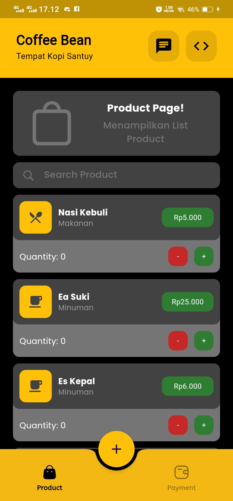
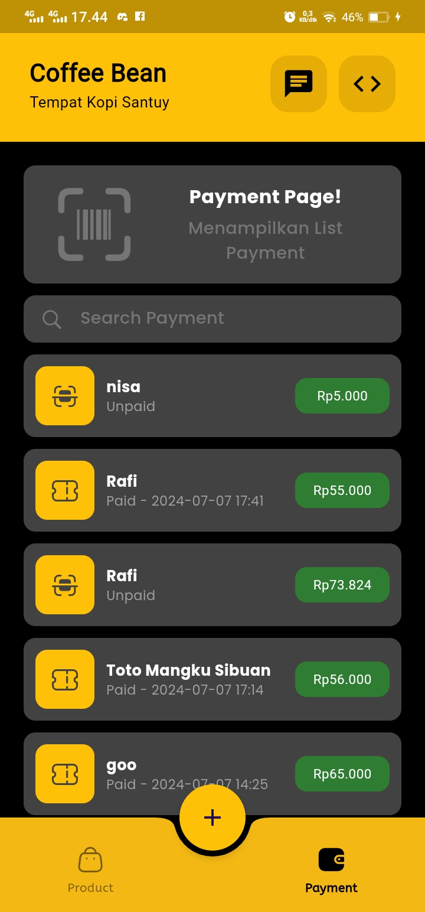
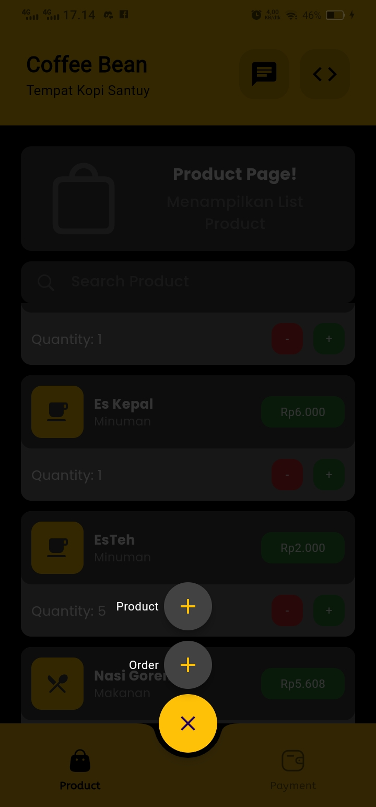
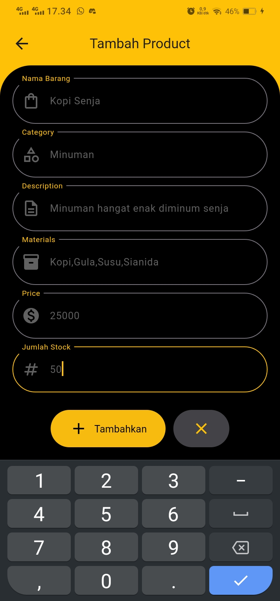
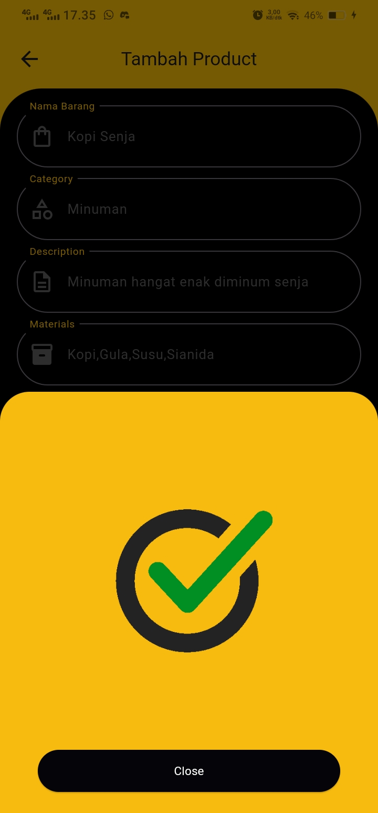
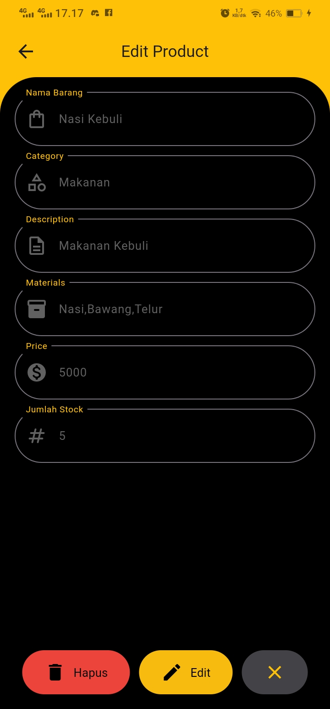
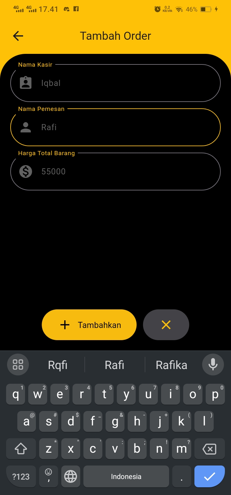
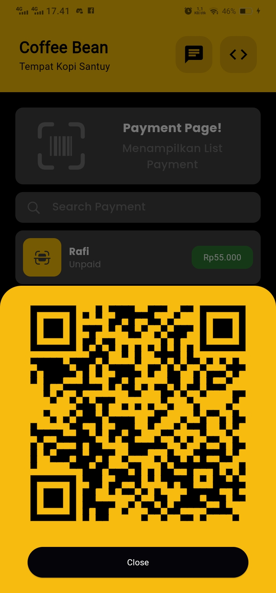
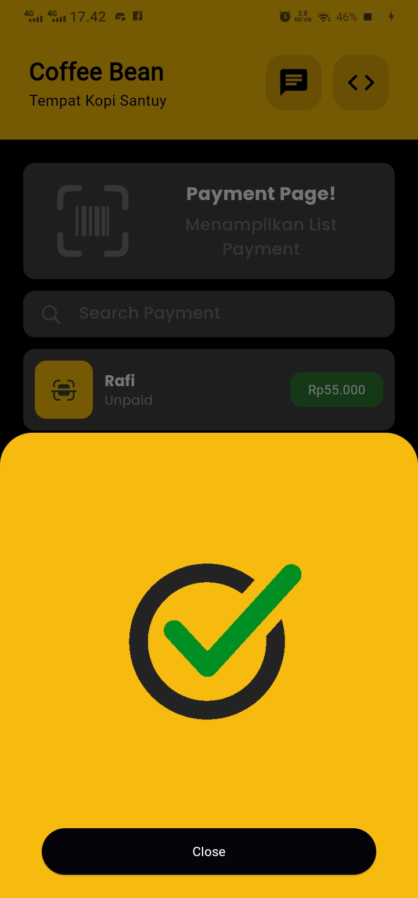
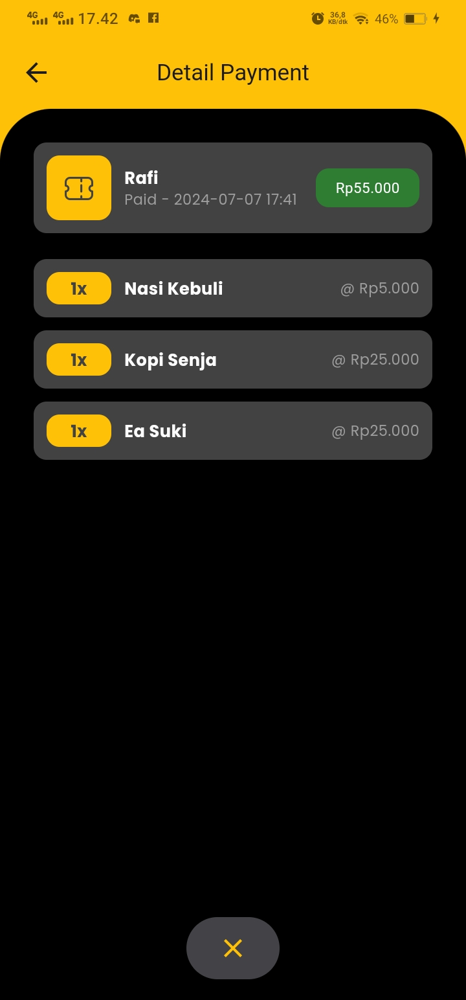

# Coffee Bean Point of Sale (POS) System

Aplikasi kasir untuk toko Coffee Bean yang membantu dalam pengelolaan produk, pemesanan, dan pembayaran.

## Fitur

### Product

1. **Create Product**
   - Menambahkan produk baru ke dalam sistem.
2. **Edit Product**
   - Mengedit detail produk yang sudah ada.
3. **Delete Product**
   - Menghapus produk dari sistem.

### Order

1. **Select Quantity Product**
   - Memilih jumlah produk yang ingin dipesan.
2. **Otomatis Menjumlahkan Produk yang Dipesan**
   - Sistem akan otomatis menghitung total harga dari produk yang dipesan.

### Payment

1. **Menghasilkan QR Pembayaran dari Order yang Dibuatkan Payment**
   - Sistem akan membuat QR code untuk pembayaran berdasarkan pesanan yang telah dibuat.
2. **Bayar Order**
   - Melakukan pembayaran untuk pesanan.
3. **Detail Payment**
   - Menampilkan detail pesanan jika sudah dibayar, atau menampilkan QR pembayaran jika belum dibayar.

## Teknologi yang Digunakan

- **Frontend:** Flutter
- **Backend:** Node.js
- **Database:** Firebase

## Cara Instalasi

### Frontend

1. Clone repository ini:
   ```bash
   git clone https://github.com/miqbalfr12/coffee-bean.git
   ```
2. Masuk ke direktori backend:
   ```bash
   cd coffee-bean
   ```
3. Install dependencies:
   ```bash
   flutter pub get
   ```
4. Jalankan aplikasi:
   ```bash
   flutter run
   ```

## Cara Penggunaan

1. **Mengelola Produk:**
   - Tambahkan, edit, atau hapus produk melalui menu manajemen produk.
2. **Membuat Pesanan:**
   - Pilih produk dan tentukan jumlah yang diinginkan.
   - Sistem akan otomatis menghitung total harga pesanan.
   - Tekan + kemudian tekan Order
3. **Pembayaran:**
   - Setelah Membuat Pesanan kemudian isikan nama Kasir dan nama Customer.
   - Lakukan pembayaran menggunakan QR code tersebut.
   - Cek detail pembayaran untuk melihat status pembayaran, atau akan otomatis menampilkan pembayaran berhasil jika sudah dibayar.

## Kontribusi

> Proyek ini dikembangkan oleh tim Kelompok 9.

    1. Muhammad Iqbal Fathur Rohman (2106184)
    2. Muhammad Rafi Indrakusumah (2106164)
    3. Siti Luthfiah Khoirotunnisa (2106105)

## Release Aplikasi

Versi saat ini dari aplikasi dapat ditemukan di [releases](https://github.com/miqbalfr12/coffee-bean/releases). Silakan kunjungi halaman releases untuk mengunduh versi terbaru dari aplikasi.

## Screenshot

<p align="center">
  
  
  
  
  
  
  
  
  
  
  
  
  
  
</p>
